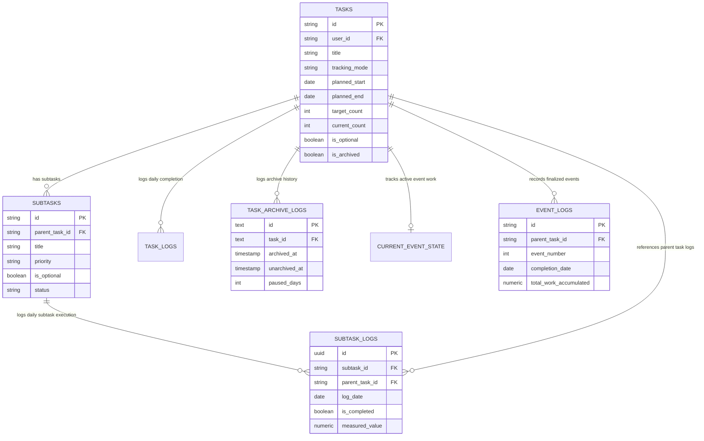

# Habit Hacker — Database Schema & Task Hierarchy Specification Document

## 1. Executive Summary & Overview

This document provides a comprehensive, single-source-of-truth specification for the **Habit Hacker** database schema, data dictionary, entity relationships, and task hierarchy constraints. 

Habit Hacker implements a structured task and habit tracking platform supporting flexible tracking modes (`end_date`, `count_days`, `count_event`), granular daily performance logging, subtask measure calculations, automated parent-child state propagation, and missed-days analytics.

---

## 2. Database Schema & Data Dictionary

The database operates on PostgreSQL / Supabase and comprises **11 main tables** and **2 analytical views**.

```
                           +------------------------+
                           |      public.tasks      |
                           +------------------------+
                             /          |         \
                            /           |          \
                           v            v           v
                 +------------+  +-------------+  +-------------------+
                 |  subtasks  |  |  task_logs  |  | task_archive_logs |
                 +------------+  +-------------+  +-------------------+
                       |
                       v
              +------------------+
              |   subtask_logs   |
              +------------------+
                       |
                       v
    +--------------------------------------+
    | view_parent_task_missed_days (View)  |
    +--------------------------------------+
```

---

### 2.1 Table: `public.tasks`

**Purpose**: Primary repository for parent tasks, standalone tasks, and top-level scheduled items. Stores metadata, tracking modes, target counts, measure tracking settings, and overall progress.

| Column Name | Data Type | Constraints / Default | Format & Description | Relationships / FK |
| :--- | :--- | :--- | :--- | :--- |
| `id` | `VARCHAR(100)` / `TEXT` | `PRIMARY KEY` | Unique 36-char UUID or string identifier | Primary Key |
| `user_id` | `VARCHAR(100)` / `TEXT` | `NOT NULL` | Owner user UUID or account ID | Maps to `auth.users(id)` |
| `title` | `VARCHAR(255)` / `TEXT` | `NOT NULL` | Descriptive name of the task | - |
| `description` | `TEXT` | `NULL` | Detailed notes or instructions for the task | - |
| `category` | `VARCHAR(100)` / `TEXT` | `DEFAULT 'General'` | Domain category (e.g. `'Coding'`, `'Health'`, `'Education'`) | - |
| `priority` | `VARCHAR(20)` / `TEXT` | `DEFAULT 'MEDIUM'` | Priority level: `'CRITICAL'`, `'HIGH'`, `'MEDIUM'`, `'LOW'`, `'NONE'` | - |
| `tracking_mode` | `VARCHAR(50)` / `TEXT` | `DEFAULT 'end_date'` | Execution tracking model: `'end_date'`, `'count_days'`, `'count_event'` | - |
| `planned_start` | `DATE` | `NULL` | Scheduled start date (`YYYY-MM-DD`) | - |
| `planned_end` | `DATE` | `NULL` | Target completion date or deadline (`YYYY-MM-DD`) | - |
| `deadline` | `DATE` | `NULL` | Hard deadline date for execution (`YYYY-MM-DD`) | - |
| `target_count` | `INT` | `DEFAULT 30` | Overall numerical target units/days/events | - |
| `current_count` | `INT` | `DEFAULT 0` | Current accumulated units/days/events | - |
| `target_day_count` | `INT` | `NULL` | Specific day accumulation target for `count_days` mode | - |
| `current_day_count` | `INT` | `DEFAULT 0` | Successfully completed days total for `count_days` mode | - |
| `target_event_count` | `INT` | `NULL` | Target repetitions for `count_event` mode | - |
| `current_event_count` | `INT` | `DEFAULT 0` | Completed discrete events count for `count_event` mode | - |
| `progress_percent` | `INT` | `DEFAULT 0` | Completion percentage (0 - 100%) | - |
| `has_measure_tracking`| `BOOLEAN` | `DEFAULT FALSE` | Flag indicating if task requires numerical measurement | - |
| `measure_unit` | `VARCHAR(50)` / `TEXT` | `DEFAULT 'units'` | Measurement unit label (e.g. `'Pages'`, `'Km'`, `'Problems'`, `'Mins'`) | - |
| `measure_target` | `NUMERIC(10, 2)` | `DEFAULT 0.0` | Target numerical value required per completion | - |
| `is_optional` | `BOOLEAN` | `DEFAULT FALSE` | If `TRUE`, task does not impact main discipline score | - |
| `is_archived` | `BOOLEAN` | `DEFAULT FALSE` | Soft-deletion and archive state flag | - |
| `archive_count` | `INT` | `DEFAULT 0` | Number of times this task has been archived | - |
| `paused_days` | `INT` | `DEFAULT 0` | Total cumulative calendar days spent in archived state | - |
| `archived_at` | `TIMESTAMPTZ` | `NULL` | Timestamp when task was archived | - |
| `is_done_today` | `BOOLEAN` | `DEFAULT FALSE` | Flag indicating if task was completed on current date | - |
| `skip_reason` | `TEXT` | `NULL` | Reason text recorded if task was skipped | - |
| `recurrence_pattern` | `VARCHAR(50)` / `TEXT` | `DEFAULT 'Daily'` | Recurrence frequency (`'Daily'`, `'Weekly'`, `'Monthly'`) | - |
| `parent_task_id` | `VARCHAR(100)` / `TEXT` | `NULL` | Links subtask directly within `tasks` table if applicable | Self-ref `tasks(id)` |
| `created_at` | `TIMESTAMPTZ` | `DEFAULT NOW()` | Record creation timestamp | - |
| `updated_at` | `TIMESTAMPTZ` | `DEFAULT NOW()` | Auto-updated modification timestamp | - |

---

### 2.2 Table: `public.subtasks`

**Purpose**: Defines child subtasks associated with a parent task in `tasks`. Specifies priority, optional/mandatory state, and completion status.

| Column Name | Data Type | Constraints / Default | Format & Description | Relationships / FK |
| :--- | :--- | :--- | :--- | :--- |
| `id` | `VARCHAR(100)` | `PRIMARY KEY` | Unique subtask ID | Primary Key |
| `parent_task_id` | `VARCHAR(100)` | `NOT NULL` | Parent task UUID | FK -> `public.tasks(id)` ON DELETE CASCADE |
| `title` | `VARCHAR(255)` | `NOT NULL` | Subtask title | - |
| `priority` | `VARCHAR(20)` | `DEFAULT 'MEDIUM'` | Priority level (`'HIGH'`, `'MEDIUM'`, `'LOW'`) | - |
| `is_optional` | `BOOLEAN` | `DEFAULT FALSE` | Mandatory (`FALSE`) vs. Optional (`TRUE`) classification | - |
| `status` | `VARCHAR(20)` | `DEFAULT 'PLANNED'` | Subtask status (`'PLANNED'`, `'COMPLETED'`, `'SKIPPED'`) | - |
| `target_value` | `INT` | `DEFAULT 1` | Numerical quantity target for subtask | - |
| `completed_value` | `INT` | `DEFAULT 0` | Current completed numerical value | - |
| `estimated_minutes`| `INT` | `DEFAULT 15` | Estimated time duration in minutes | - |
| `created_at` | `TIMESTAMPTZ` | `DEFAULT NOW()` | Creation timestamp | - |

---

### 2.3 Table: `public.task_logs`

**Purpose**: Records daily activity, completion logs, and measured value metrics for parent/standalone tasks.

| Column Name | Data Type | Constraints / Default | Format & Description | Relationships / FK |
| :--- | :--- | :--- | :--- | :--- |
| `id` | `BIGSERIAL` / `TEXT` | `PRIMARY KEY` | Log record identifier | Primary Key |
| `task_id` | `VARCHAR(100)` / `TEXT` | `NOT NULL` | Target parent task ID | FK -> `public.tasks(id)` |
| `user_id` | `VARCHAR(100)` / `TEXT` | `NOT NULL` | User identifier | FK -> `auth.users(id)` |
| `log_date` / `logged_date` | `DATE` | `DEFAULT CURRENT_DATE` | Date of log entry (`YYYY-MM-DD`) | - |
| `is_completed` / `is_successful` | `BOOLEAN` | `DEFAULT TRUE` | Completion outcome for the day | - |
| `measured_value` | `NUMERIC(10, 2)` | `DEFAULT 0.0` | Recorded quantitative measure value | - |
| `tracking_mode` | `VARCHAR(50)` | `DEFAULT 'end_date'` | Mode under which task was logged | - |
| `skip_reason` | `TEXT` | `NULL` | Explanation if task was skipped | - |
| `created_at` | `TIMESTAMPTZ` | `DEFAULT NOW()` | Log timestamp | - |

---

### 2.4 Table: `public.subtask_logs`

**Purpose**: Granular daily performance log table capturing individual subtask completion states and measured numerical values for each date.

| Column Name | Data Type | Constraints / Default | Format & Description | Relationships / FK |
| :--- | :--- | :--- | :--- | :--- |
| `id` | `TEXT` / `UUID` | `PRIMARY KEY`, Default UUID | Log record ID | Primary Key |
| `subtask_id` | `VARCHAR(255)` / `TEXT` | `NOT NULL` | Target child subtask ID | FK -> `public.subtasks(id)` |
| `parent_task_id` | `VARCHAR(255)` / `TEXT` | `NOT NULL` | Parent task UUID | FK -> `public.tasks(id)` |
| `user_id` | `VARCHAR(255)` / `TEXT` | `NOT NULL` | User ID | FK -> `auth.users(id)` |
| `log_date` | `DATE` | `NOT NULL` | Specific log date (`YYYY-MM-DD`) | Composite UNIQUE (`subtask_id`, `log_date`) |
| `is_completed` | `BOOLEAN` | `DEFAULT FALSE` | Whether subtask was finished on `log_date` | - |
| `measured_value` | `NUMERIC(10, 2)` | `DEFAULT 0.0` | Quantitative measure achieved | - |
| `event_count` | `INT` | `DEFAULT 0` | Number of events completed | - |
| `notes` | `TEXT` | `NULL` | User notes for the day's execution | - |
| `created_at` | `TIMESTAMPTZ` | `DEFAULT NOW()` | Creation timestamp | - |

---

### 2.5 Table: `public.event_logs`

**Purpose**: Immutable historical record of completed discrete events for `count_event` tracking mode tasks.

| Column Name | Data Type | Constraints / Default | Format & Description | Relationships / FK |
| :--- | :--- | :--- | :--- | :--- |
| `id` | `VARCHAR(255)` | `PRIMARY KEY` | Event log ID (e.g. `'ev-1001'`) | Primary Key |
| `parent_task_id` | `VARCHAR(255)` | `NOT NULL` | Target parent task ID | FK -> `public.tasks(id)` |
| `user_id` | `VARCHAR(255)` | `NOT NULL` | User identifier | FK -> `auth.users(id)` |
| `event_number` | `INT` | `NOT NULL` | Sequential event count number (1, 2, 3...) | - |
| `completion_date` | `DATE` | `NOT NULL` | Date event was completed (`YYYY-MM-DD`) | - |
| `event_unit_target` | `NUMERIC(10, 2)` | `DEFAULT 10.0` | Target work required to finish 1 event | - |
| `event_unit_name` | `VARCHAR(100)` | `DEFAULT 'units'` | Unit label (e.g. `'questions'`, `'reps'`) | - |
| `total_work_accumulated` | `NUMERIC(10, 2)` | `DEFAULT 0.0` | Sum of subtask work contributing to event | - |
| `subtask_contributions_json` | `JSONB` | `DEFAULT '[]'` | Breakdown of subtask contributions | JSON array of `{subtaskId, workAmount, color}` |
| `status` | `VARCHAR(50)` | `DEFAULT 'FINALIZED'` | Event status (`'FINALIZED'`) | - |
| `created_at` | `TIMESTAMPTZ` | `DEFAULT NOW()` | Completion timestamp | - |

---

### 2.6 Table: `public.current_event_state`

**Purpose**: Transient active storage table tracking un-finalized work accumulation towards completing the next event in `count_event` mode.

| Column Name | Data Type | Constraints / Default | Format & Description | Relationships / FK |
| :--- | :--- | :--- | :--- | :--- |
| `parent_task_id` | `VARCHAR(255)` | `PRIMARY KEY` | Parent task UUID | FK -> `public.tasks(id)` |
| `user_id` | `VARCHAR(255)` | `NOT NULL` | User identifier | FK -> `auth.users(id)` |
| `current_work_accumulated`| `NUMERIC(10, 2)` | `DEFAULT 0.0` | Active work accumulated towards next event | Reset to `0` upon event completion |
| `subtask_works_json` | `JSONB` | `DEFAULT '{}'` | Key-value store of subtask work accumulated | JSON map of `{ subtaskId: workVal }` |
| `updated_at` | `TIMESTAMPTZ` | `DEFAULT NOW()` | Last update timestamp | - |

---

### 2.7 Table: `public.task_archive_logs`

**Purpose**: Tracks archive and unarchive history for tasks. Used by database triggers to automatically calculate pause duration and extend task end dates.

| Column Name | Data Type | Constraints / Default | Format & Description | Relationships / FK |
| :--- | :--- | :--- | :--- | :--- |
| `id` | `TEXT` | `PRIMARY KEY`, Default UUID | Archive log ID | Primary Key |
| `task_id` | `TEXT` | `NOT NULL` | Parent task ID | FK -> `public.tasks(id)` |
| `user_id` | `TEXT` | `NOT NULL` | User ID | FK -> `auth.users(id)` |
| `archived_at` | `TIMESTAMPTZ` | `DEFAULT NOW()` | Date/time task was archived | - |
| `unarchived_at` | `TIMESTAMPTZ` | `NULL` | Date/time task was unarchived | Set upon unarchiving |
| `paused_days` | `INT` | `DEFAULT 0` | Calculated pause duration in days | `EXTRACT(DAY FROM (unarchived_at - archived_at))` |
| `extension_applied_days` | `INT` | `DEFAULT 0` | End date extension applied in days | Matches `paused_days` |
| `created_at` | `TIMESTAMPTZ` | `DEFAULT NOW()` | Creation timestamp | - |

---

### 2.8 Table: `public.habits`

**Purpose**: Dedicated table for recurring habits, tracking target frequencies, current streaks, and daily check-ins.

| Column Name | Data Type | Constraints / Default | Format & Description | Relationships / FK |
| :--- | :--- | :--- | :--- | :--- |
| `id` | `VARCHAR(100)` | `PRIMARY KEY` | Unique habit ID | Primary Key |
| `user_id` | `VARCHAR(100)` | `NOT NULL` | User identifier | FK -> `auth.users(id)` |
| `title` | `VARCHAR(255)` | `NOT NULL` | Name of habit | - |
| `category` | `VARCHAR(100)` | `DEFAULT 'General'` | Category tag | - |
| `frequency` | `VARCHAR(50)` | `DEFAULT 'DAILY'` | Frequency (`'DAILY'`, `'WEEKLY'`) | - |
| `target_value` | `INT` | `DEFAULT 1` | Frequency target per day | - |
| `unit` | `VARCHAR(50)` | `DEFAULT 'times'` | Measurement unit | - |
| `is_completed_today`| `BOOLEAN` | `DEFAULT FALSE` | Today's completion status | Reset daily |
| `streak_days` | `INT` | `DEFAULT 0` | Consecutive days streak count | - |
| `created_at` | `TIMESTAMPTZ` | `DEFAULT NOW()` | Record creation timestamp | - |

---

### 2.9 Table: `public.capacity_settings`

**Purpose**: Manages user daily productivity capacity budget in minutes.

| Column Name | Data Type | Constraints / Default | Format & Description | Relationships / FK |
| :--- | :--- | :--- | :--- | :--- |
| `user_id` | `VARCHAR(100)` | `PRIMARY KEY` | User ID | Primary Key |
| `available_capacity_minutes` | `INT` | `DEFAULT 480` | Daily available capacity (e.g. 480 mins = 8 hours) | - |
| `updated_at` | `TIMESTAMPTZ` | `DEFAULT NOW()` | Update timestamp | - |

---

### 2.10 Table: `public.reflections_diary`

**Purpose**: Stores daily diary notes, mood ratings, and self-reflection entries.

| Column Name | Data Type | Constraints / Default | Format & Description | Relationships / FK |
| :--- | :--- | :--- | :--- | :--- |
| `id` | `BIGSERIAL` | `PRIMARY KEY` | Entry ID | Primary Key |
| `user_id` | `VARCHAR(100)` | `NOT NULL` | User ID | FK -> `auth.users(id)` |
| `entry_date` | `DATE` | `DEFAULT CURRENT_DATE` | Date of diary entry | - |
| `mood` | `VARCHAR(50)` | `NULL` | Mood rating (`'GREAT'`, `'GOOD'`, `'OK'`, `'POOR'`) | - |
| `content` | `TEXT` | `NULL` | Markdown reflection content | - |
| `created_at` | `TIMESTAMPTZ` | `DEFAULT NOW()` | Creation timestamp | - |

---

### 2.11 Table: `public.goals`

**Purpose**: High-level long-term goals and milestones linked to categories and target dates.

| Column Name | Data Type | Constraints / Default | Format & Description | Relationships / FK |
| :--- | :--- | :--- | :--- | :--- |
| `id` | `VARCHAR(100)` | `PRIMARY KEY` | Goal ID | Primary Key |
| `user_id` | `VARCHAR(100)` | `NOT NULL` | User ID | FK -> `auth.users(id)` |
| `title` | `VARCHAR(255)` | `NOT NULL` | Goal title | - |
| `target_date` | `DATE` | `NULL` | Target deadline date | - |
| `progress_percent`| `INT` | `DEFAULT 0` | Target completion percentage | - |
| `category` | `VARCHAR(100)` | `DEFAULT 'General'` | Domain category | - |
| `status` | `VARCHAR(50)` | `DEFAULT 'ACTIVE'` | Goal status (`'ACTIVE'`, `'COMPLETED'`, `'PAUSED'`) | - |
| `created_at` | `TIMESTAMPTZ` | `DEFAULT NOW()` | Creation timestamp | - |

---

### 2.12 Analytical Views

#### 1. View: `public.view_parent_task_missed_days`

**SQL Query & Definition**:
```sql
CREATE OR REPLACE VIEW public.view_parent_task_missed_days AS
WITH mandatory_subtasks AS (
    SELECT id AS subtask_id, parent_task_id, title AS subtask_title
    FROM public.subtasks
    WHERE is_optional = FALSE OR is_optional IS NULL
),
daily_missed_records AS (
    SELECT ms.parent_task_id, sl.log_date, ms.subtask_title
    FROM mandatory_subtasks ms
    JOIN public.subtask_logs sl ON ms.subtask_id = sl.subtask_id
    WHERE sl.is_completed = FALSE
)
SELECT 
    parent_task_id,
    log_date,
    COUNT(subtask_title) AS missed_subtasks_count,
    STRING_AGG(subtask_title, ', ' ORDER BY subtask_title) AS missed_subtasks_list,
    ARRAY_AGG(subtask_title ORDER BY subtask_title) AS missed_subtasks_array
FROM daily_missed_records
GROUP BY parent_task_id, log_date
ORDER BY log_date DESC;
```

#### 2. View: `public.v_subtask_failure_summary`

**SQL Query & Definition**:
```sql
CREATE OR REPLACE VIEW public.v_subtask_failure_summary AS
SELECT 
    parent_task_id,
    subtask_id,
    COUNT(*) FILTER (WHERE is_completed = FALSE) AS missed_days_count,
    COUNT(*) AS total_logged_days,
    ROUND((COUNT(*) FILTER (WHERE is_completed = FALSE)::NUMERIC / GREATEST(1, COUNT(*))) * 100, 1) AS failure_rate_percent
FROM public.subtask_logs
GROUP BY parent_task_id, subtask_id;
```

---

## 3. Comprehensive Point-by-Point Task Hierarchy & Constraints Specification

Below is the detailed, point-by-point breakdown of all task hierarchy rules, manual toggle restrictions, parent auto-completion mechanics, subtask measure algorithms, and auto-archive behaviors implemented across Habit Hacker.

---

### Point 1: Parent-Child Task Linkage (`parent_task_id`)
1. Child subtasks link to parent tasks via the `parent_task_id` foreign key.
2. A task without subtasks (`subtasks.length === 0`) or with `parent_task_id IS NULL` is classified as a **Standalone Task**.
3. Deleting a parent task automatically cascades and deletes all associated child subtasks, subtask logs, and event states (`ON DELETE CASCADE`).

---

### Point 2: Subtask Classification — Mandatory vs. Optional Subtasks
1. **Mandatory Subtasks (`is_optional = FALSE`)**:
   - Represent critical, non-negotiable components of the parent task.
   - **Parent Completion Blocking**: A parent task CANNOT be completed until **100% of its mandatory subtasks are completed**.
   - **Missed Day Trigger**: If any mandatory subtask is incomplete on a target date, that date is flagged and logged as a **Missed Day** for the parent task in `view_parent_task_missed_days`.
2. **Optional Subtasks (`is_optional = TRUE`)**:
   - Represent bonus, extra, or supplementary work items.
   - **Non-Blocking**: Optional subtasks **NEVER block parent completion**.
   - **No Missed Days**: Failing to complete an optional subtask does **NOT** generate a missed day or lower the discipline score.

---

### Point 3: Parent Task Manual Toggle & Completion Constraints
1. **Parent Tasks with Mandatory Subtasks**:
   - **MANUAL COMPLETE DISABLED**: The user CANNOT directly check off or manually toggle a parent task that has mandatory subtasks.
   - The UI disables manual completion for parent tasks to prevent state corruption (`canManuallyCompleteTask() === false`).
   - Parent task completion status is derived **exclusively and automatically** from the underlying child subtasks.
2. **Edge Case Rules for Parent Manual Completion**:
   - **Standalone Tasks**: Parent tasks with 0 subtasks can be manually completed by user tap anytime.
   - **Single Optional Subtask Exception**: If a parent task has **exactly 1 subtask and that subtask is optional**, the parent task behaves as a standalone task and permits manual user toggle.
   - **All-Optional Subtasks Parent**: If a parent task contains **only optional subtasks** (0 mandatory subtasks), the parent completes automatically when at least 1 optional subtask is completed, or can be manually completed by the user.

---

### Point 4: Automatic Parent Completion Mechanics
1. A parent task automatically updates its status to **Completed** (`is_done_today = TRUE`, `progress_percent = 100`) **ONLY when all mandatory subtasks are completed** (`completedMandatory === totalMandatory`).
2. If at least 1 mandatory subtask is completed but others remain incomplete, the parent task transitions to **Partially Completed** state.
3. Unchecking any mandatory subtask immediately reverts the parent task back from `Completed` to `Partially Completed` or `PLANNED`.

---

### Point 5: Subtask Measure & Daily Parent Progress Algorithm
1. **No Independent Parent Measure**: A parent task with children has no standalone measure input field. The parent's total daily measure is strictly computed as the sum of child subtask contributions.
2. **Measurable Average Computation (`avgMeasure`)**:
   - `avgMeasure` is computed EXCLUSIVELY from subtasks that have explicit numerical measures (`has_measure_tracking = TRUE` or `measure_target > 0`).
   - Subtasks without numerical measures and event-based subtasks are **excluded** from the average calculation.
   - **Fallback Rule**: If no subtasks have numerical measure targets, `avgMeasure` defaults safely to `1.0` (prevents division by zero).
3. **Subtask Contribution Types**:
   - **Measurable Subtask**: Contributes its exact logged numerical value (`loggedMeasureVal`).
   - **Event-Based Subtask (`count_event`)**: Contributes `(Event Count × avgMeasure)`.
   - **Standard Checkbox Subtask (No Measure)**: Contributes `(1 × avgMeasure)` when completed, and `0` when incomplete.

---

### Point 6: Tracking Modes & Execution Metrics
1. **`end_date` (Start / End Date Plan)**:
   - Evaluates progress over a calendar date window defined by `planned_start` and `planned_end`.
   - Daily execution requires completing subtasks continuously within the scheduled date range.
2. **`count_days` (Days Count Task)**:
   - Target is defined by `target_day_count` (e.g. 30 successful running days in a 45-day window).
   - Each calendar day where all mandatory subtasks are completed increments `current_day_count` by `1`.
3. **`count_event` (Event Count Task)**:
   - Target is defined by `target_event_count` (e.g. 110 LeetCode problems in 30 days).
   - Increments discrete events whenever accumulated subtask work reaches `event_unit_target`.

---

### Point 7: Multi-Event per Day & Transient State (`current_event_state`)
1. In `count_event` mode, multiple events can be completed on the same calendar day.
2. Transient work is stored in `current_event_state.current_work_accumulated`.
3. When `current_work_accumulated` reaches `event_unit_target` (e.g. 10 units):
   - An immutable event log is inserted into `public.event_logs` with `event_number = current_event_count + 1`.
   - `current_event_count` on `public.tasks` is incremented by `1`.
   - `current_event_state` work counter resets to `0` to accept further work.

---

### Point 8: 5-Day Blank Auto-Archive & Unarchive Extension Rule
1. **5-Day Blank Rule**:
   - If a task's `planned_end` date has passed by **5 or more calendar days** and the task remains incomplete with 0 recent progress or uncompleted mandatory subtasks:
   - The task engine marks `is_archived = TRUE` and sets `archived_at = NOW()`.
   - **Completed Tasks Protection**: Tasks that reached 100% progress or completed all targets are **NEVER** auto-archived.
2. **Unarchive Extension Trigger (`handle_task_unarchive_extension`)**:
   - When an archived task is unarchived by the user (`OLD.is_archived = TRUE` -> `NEW.is_archived = FALSE`):
   - The database trigger calculates paused duration: `paused_days = EXTRACT(DAY FROM (NOW() - archived_at))`.
   - The task's `planned_end` date is automatically extended by `paused_days`:
     $$\text{planned\_end}_{\text{new}} = \text{planned\_end}_{\text{old}} + \text{paused\_days}$$
   - An entry is logged in `public.task_archive_logs` to maintain an audit trail of extensions.

---

## 4. Entity Relationship Diagram (Mermaid)



---

## 5. Summary Matrix of Constraints

| Feature / Scenario | Standalone Task | Parent with Mandatory Subtasks | Parent with ONLY Optional Subtasks | Single Optional Subtask Parent |
| :--- | :--- | :--- | :--- | :--- |
| **Manual Toggle Allowed?** | Yes | **NO** (Disabled in UI) | Yes | Yes (Behaves as standalone) |
| **Auto-Completion Trigger** | Checkbox tap | All mandatory subtasks completed | At least 1 optional subtask done | Subtask completed or manual tap |
| **Generates Missed Days?** | If skipped/uncompleted | **YES** (If mandatory subtask incomplete) | **NO** | **NO** |
| **Measure Target Source** | Direct task measure | Sum of child subtask contributions | Sum of child subtask contributions | Direct subtask measure |
| **5-Day Auto-Archive Rule** | Applies if expired | Applies if expired | Applies if expired | Applies if expired |
